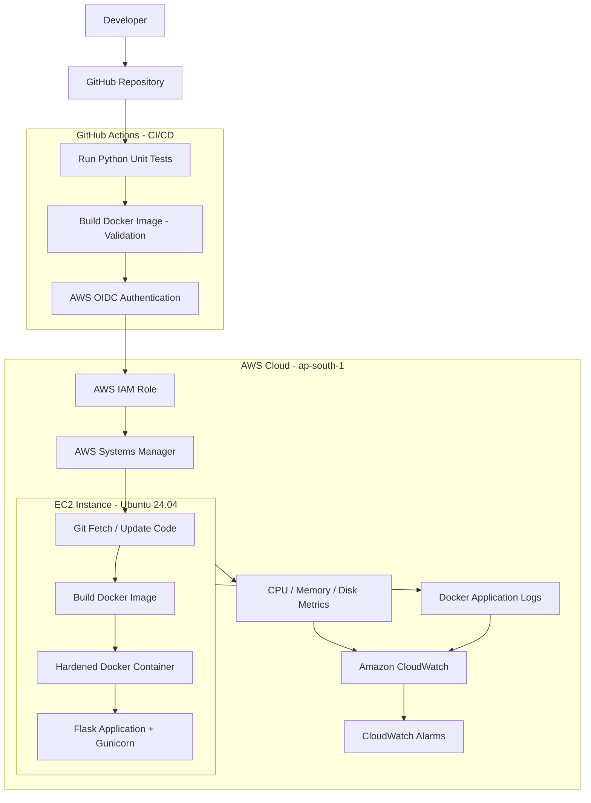

# CloudDeploy AWS Architecture

## Architecture Diagram

The following diagram illustrates the automated deployment workflow and AWS infrastructure.

```mermaid
flowchart TB
    DEV["Developer"]
    GH["GitHub Repository"]

    subgraph GHA["GitHub Actions - CI/CD"]
        TEST["Run Python Unit Tests"]
        BUILD["Build Docker Image - Validation"]
        OIDC["AWS OIDC Authentication"]
    end

    subgraph AWS["AWS Cloud - ap-south-1"]
        IAM["AWS IAM Role"]
        SSM["AWS Systems Manager"]

        subgraph EC2["EC2 Instance - Ubuntu 24.04"]
            GIT["Git Fetch / Update Code"]
            DOCKER["Build Docker Image"]
            CONTAINER["Hardened Docker Container"]
            APP["Flask Application + Gunicorn"]
        end

        CW["Amazon CloudWatch"]
        METRICS["CPU / Memory / Disk Metrics"]
        LOGS["Docker Application Logs"]
        ALARMS["CloudWatch Alarms"]
    end

    DEV --> GH
    GH --> TEST
    TEST --> BUILD
    BUILD --> OIDC
    OIDC --> IAM
    IAM --> SSM
    SSM --> GIT
    GIT --> DOCKER
    DOCKER --> CONTAINER
    CONTAINER --> APP

    EC2 --> METRICS
    EC2 --> LOGS
    METRICS --> CW
    LOGS --> CW
    CW --> ALARMS

```
